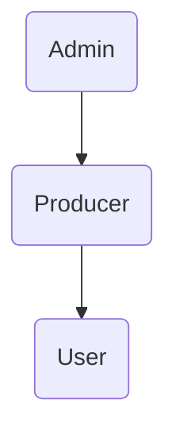

# Provided function

The GAPP platform mainly provided the following function:

- **Task Analysis**, user can upload their data for different applications to analysis, and view the analyses report.

## Application

  Applications with different focuses are provided by producers. They are sorted by categories.

## Analysis

  GAPP allow users to upload their data as well as select data from your dataset, and submit the data to deepomics for analysis. 

# User management

## Invitation Mechanism

- GAPP uses a simple **invitation mechanism** user system. 

- At current stage, this platform functions are only available to authorized users. A user need a unique invitation code from admin to get an account. You can contact the platform management personnel for permission which is based on your valid email.

- Their contact information can be fount at the platform `Contact` page.

## Cascade 

- An Admin is also a producer and a user.

- A Producer is also a user.
