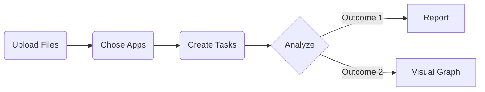

## Intro

This documentation will teach you how to add your tasks for different applications(analyses) to generate corresponding report as well as visualizations.

**Before you start:**

- you should have a authenticated account.

## System Overview

###### Process Flow

## Detailed Steps

### *Upload Files*

- Login to your account 
- Go to `Profile` Page where the Files that have been uploaded and the tasks have been created are shown.
- File uploading button can be found at the `Data Management` session.

> **Note that:** Only ***.bam*** and ***.fq*** files can be accepted. 

These uploaded files would be stored for your own use and access.

You can modified file name or delete it in the `Data`table.

### *Chose Applications*

**Two ways -**

1. **If you are familiar and already know what application to use**

   - Go to the `Apps` Page where all the applications are shown in detail

   - You can click `View` to check whether it's published or not and `See Demo` to check its demonstration

   - Click `Run This App` to chose it

     

2. **If you wonder what application suits you best**

   - Go to the `Profile` Page

   - The Applications are sorted by different categories which are shown in the `Task Status` session

   - Chose the category and there are `Detail` button and `Create` button for every application

     

### *Create Tasks*

After `Create` or `Run This App` is clicked, two fields are compulsory for a task  -

- `Select Data`
- `Task Name`

The Data is the files you have uploaded in the first step. And a valid name should have length between 3 and 5.

### *About Pipeline*

There are ***Four*** main stages of Running Pipeline - 

- Extract Data and Analyze
- Clean and Format analysis results
- Write processed results into report
- Using processed result to generate visual graph

### *About Outcomes*

- `Report`
- `Visual Graph`

Both of them can be found in specific task page - 

- Go to the `Profile` Page
- In the `Task Status` session, select category of corresponding application
- The analysis progress can be checked through the progress bar here
- Click `More` to get in to the detailed task page
