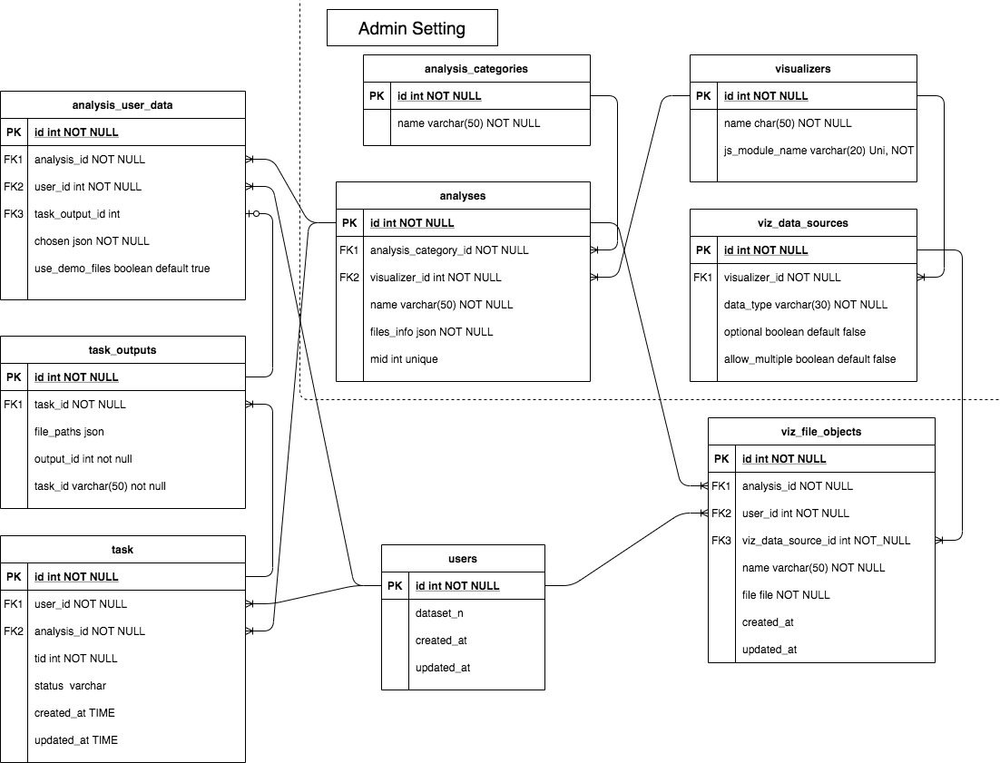

## Intro

   This documentation will teach you how to add your visualization module into meta platform step by step.

   **Before you start**:
   1. you should have basic knowledge of Oviz.
   2. you should have basic knowlege of JavaScript(ES6), typescript.
   
   **After reading this**:
   1. You should be able to create a new visualizer module in meta_platform.
   


## System Overvirew

**Visualization mode**

The platform has 2 viz mode:
1. query_task
2. visualization - anlaysis (standalone)

**Javscript Code Structure Overview**

      app
      └───javascript                      
          └───packs
          |   └───viz  
          |       └───scatterplot.js
          └───viz
              └───index.ts
              └───scatterplot
                  └───index.ts
                  └───template.bvt
                  └───editor.ts
                  └───data.ts
                  └───complex-scatterplot.ts


**Database Design Overview**



Some concepts:
1. Visualizer is the chart, e.g. scatterplot, heatmap...
2. Analysis has the concrete meaning. e.g. CCA, pathway enrichment... An analysis can refer to a deepomics module, which is by the **mid** field.
3. A visualizer can be used by multiple analyses, for example, scatterplot can be used by entrotype and CCA.
4. A visualizer takes the analysis output files as input, these files called data sources in visualizer module.
5. An analysis may only use parts of the data sources. e.g. CCA won't have vector data. The binding of analysis to viz data sources is done by the files_info field (json) of analysis.

**important conventions**

1. **visualizer module name**: 
    The module name is used to distinguish visualizers. The viz folder name, `MODULE_NAME` in index.ts, js pack name should all have the same name.
2. **data type**: 
    The `dataType` is the key of data sources. If you had used bvd-rails before, you should notice that the fileKey system design is different in meta_platform. In meta, the data source type should be the same as the fileKey of the data source, which means, one file can only be used for one visualizer and one analysis.

## Add a new visualizer

**Before you start** Clone the [meta project](https://delta.cs.cityu.edu.hk/chelijia/meta_platform) and install it.

### 1: Develop your visualizer module.


### 2: Add file.

#### 2.1: File structure

The visualizer folder should contains these files, 
1. index.ts, the main javascript logic.
2. template.bvt, the template for drawing chart, written in oviz
3. editor.ts, the oviz editor related code.
4. data.ts, if the data processing is quite complicated, it is recommended to seperate the data processing logic from the `index.ts` into `data.ts`.
5. other customed components.

#### 2.2 index file conventions
  A index file must contain:
  ```typescript
  const MODULE_NAME = "scatterplot";

  function init() {
    if (!window.gon || window.gon.module_name !== MODULE_NAME)    
    return;
    ...
  };

  register(MODULE_NAME, init);

  export function registerScatterplot(){
      register(MODULE_NAME, init);
  }
  ```

#### 2.3: Register the visualizer

Now we have created our visualizer module, we need to tell the task_query module and analyis module how to use it.

1. register for task_query mode
Open 'app/javascript/viz/index.ts', inside `registerViz` function, add your case.
2. register for standalone analysis mode
Create a new js file under 'app/javascript/packs', the js name should be the same as the `MODULE_NAME`

#### 2.4: Set the demo files

Go to `$project_root/data/demo`, create a new folder and put all the demo files of your analyses in it. **Note that demo files must be place under this root.**


### 3: Add configs in admin panel.

#### 3.1 Add the visualizer and required viz data sources

Start the server, go to [admin:visualizer](). Please contact the project admin for account and password.

Click add visualizer to create a new visualizer, 
- fill in the name, 
- the `js_module_name` is your js pack file's name, otherwise the platform cannot found the correct script file to load; 
- add the data sources you use, note that the `dataType` name must be the same as the `dataType` and `fileKey` in your code

Click `Create Visualizer` to submit the creation.


#### 3.2 Add the analysis

Go to [admin:analysis_categories](). If the analysis belongs to a existing analysis category, you can , otherwise you need to first create the analyis category, then create the analysis under that category.

Click add analysis to create a new analysis,
- fill in the name
- choose the visualizer for the analysis
- fill in the mid, the module id on deepomics, note that you can only have one analysis for one mid
- fill in the files_info json, the json format is : 
```json 
{
  "scatterData": { // the data type
    "name": "PCA Score", //the data name displayed in file uploads panel
    "outputFileName": "coordinate.xls", // the output file name by deep omics
    "demoFilePath": "/data/demo/PCA/Control_Gout_PCA.coordinate.xls" // the demo file name
  },
  ...
}
```
```json 
{
  "heatmapDataD": { // if the data source allow multiple files
    "name": "Sample Data",
    "outputFileName": [ // the outputFileName and the demoFilePath
      "T1_sample.xls", // should be an array of strings
      "T2_sample.xls",
      "T3_sample.xls"
    ],
    "demoFilePath": [
      "/data/demo/Drug_Use/T1_sample.xls",
      "/data/demo/Drug_Use/T2_sample.xls",
      "/data/demo/Drug_Use/T3_sample.xls"
    ]
  }
}
```

Click `Create Analysis`

### Finished
  You can go to [localhost:3000/visualizer/analysis/{id}]() to see the demo chart.
